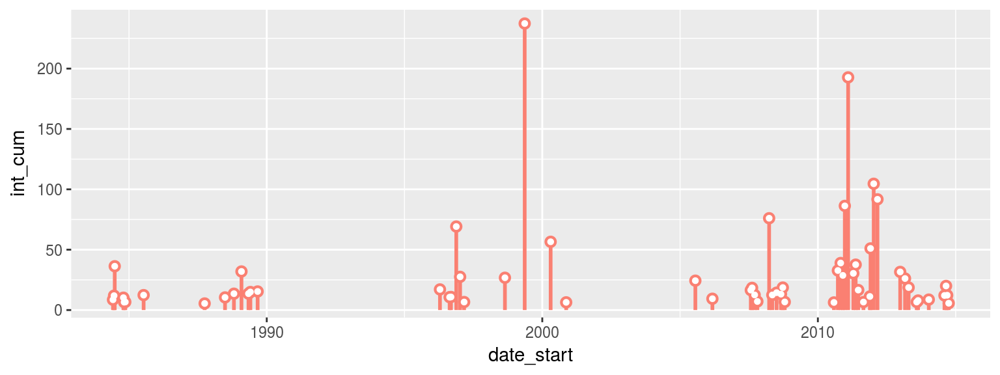
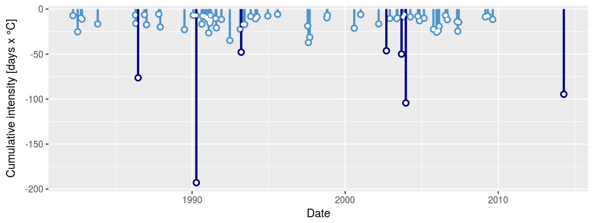
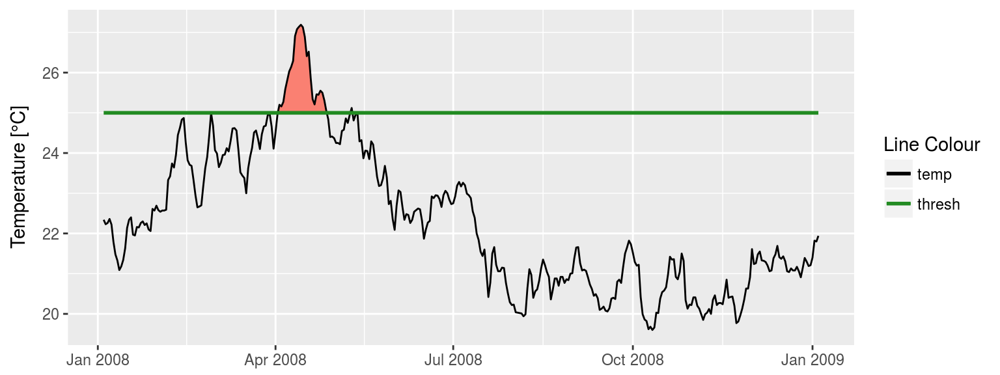
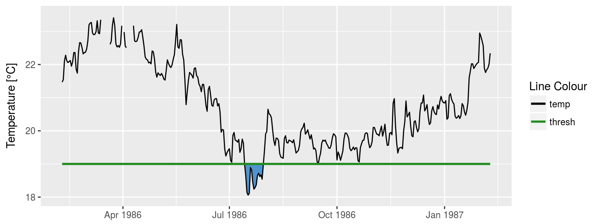
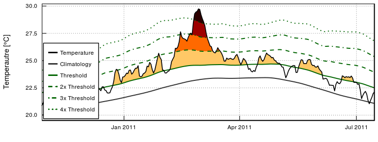

heatwaveR 
==================================================================

[](https://cran.r-project.org/package=heatwaveR) [](https://travis-ci.org/robwschlegel/heatwaveR) [](https://codecov.io/github/robwschlegel/heatwaveR?branch=master) 

The **`heatwaveR`** package is a project-wide update to the [**`RmarineHeatWaves`**](https://github.com/ajsmit/RmarineHeatWaves) package, which is itself a translation of the original [Python code](https://github.com/ecjoliver/marineHeatWaves) written by Eric C. J. Oliver. The **`heatwaveR`** package also uses the same naming conventions for objects, columns, and arguments as the Python code.

The **`heatwaveR`** R package contains the original functions from the **`RmarineHeatWaves`** package that calculate and display marine heatwaves (MHWs) according to the definition of Hobday et al. (2016) as well as calculating and visualising marine cold-spells (MCSs) as first introduced in Schlegel et al. (2017a). It also contains the functionality to calculate the categories of MHWs as outlined in Hobday et al. (2018).

This package does what **`RmarineHeatWaves`** does, but faster. The entire package has been deconstructed and modularised, and slow portions of the code are being implemented in C++. C++ has already replaced some of the bottlenecks that slowed down the climatology creation portions of the code, and we will slowly but surely improve the efficiency and speed in other portions of the code too. Currently the R code runs about as fast as the original python functions, at least in as far as applying it to single time series of temperatures. Readers familiar with both languages will know about the ongoing debate around the relative speed of the two languages. In our experience, R can be as fast as python, provided that attention is paid to finding ways to reduce the computational inefficiencies that stem from i) the liberal use of complex and inefficient non-atomic data structures, such as data frames; ii) the reliance on non-vectorised calculations such as loops; and iii) lazy (but convenient) coding that comes from drawing too heavily on the `tidyverse` suite of packages. We will continue to ensure that **`heatwaveR`** becomes more-and-more efficient so that it can be applied to large gridded data products with ease.

This new package was developed and released in order to better accommodate the inclusion of the definitions of atmospheric heatwaves in addition to MHWs. Additionally, **`heatwaveR`** also provides the first implementation of a definition for a ‘compound heatwave’. There are currently multiple different definitions for this type of event and each of which has arguments provided for it within the `ts2clm()` and `detect_event()` functions.

This package may be installed from CRAN by typing the following command into the console:

`install.packages("heatwaveR")`

Or the development version may be installed from GitHub with:

`devtools::install_github("robwschlegel/heatwaveR")`

The functions
-------------

<table>
<colgroup>
<col width="17%" />
<col width="82%" />
</colgroup>
<thead>
<tr class="header">
<th>Function</th>
<th>Description</th>
</tr>
</thead>
<tbody>
<tr class="odd">
<td><code>ts2clm()</code></td>
<td>Constructs seasonal and threshold climatologies as per the definition of Hobday et al. (2016).</td>
</tr>
<tr class="even">
<td><code>detect_event()</code></td>
<td>The main function which detects the events as per the definition of Hobday et al. (2016).</td>
</tr>
<tr class="odd">
<td><code>block_average()</code></td>
<td>Calculates annual means for event metrics.</td>
</tr>
<tr class="even">
<td><code>category()</code></td>
<td>Applies event categories to the output of <code>detect_event()</code> based on Hobday et al. (in review).</td>
</tr>
<tr class="odd">
<td><code>exceedance()</code></td>
<td>A function similar to <code>detect_event()</code> but that detects consecutive days above/below a given static threshold.</td>
</tr>
<tr class="even">
<td><code>event_line()</code></td>
<td>Creates a line plot of heatwaves or cold-spells.</td>
</tr>
<tr class="odd">
<td><code>lolli_plot()</code></td>
<td>Creates a timeline of selected event metrics.</td>
</tr>
<tr class="even">
<td><code>geom_flame()</code></td>
<td>Creates flame polygons of heatwaves or cold-spells.</td>
</tr>
<tr class="odd">
<td><code>geom_lolli()</code></td>
<td>Creates a lolliplot timeline of selected event metric.</td>
</tr>
</tbody>
</table>

The package also provides data of observed SST records for three historical MHWs: the 2011 Western Australia event, the 2012 Northwest Atlantic event and the 2003 Mediterranean event.

The heatwave metrics
--------------------

The function will return a list of two tibbles (see the ‘tidyverse’), `clim` and `event`, which are the climatology and MHW (or MCS) events, respectively. The climatology contains the full time series of daily temperatures, as well as the the seasonal climatology, the threshold and various aspects of the events that were detected. The software was designed for detecting extreme thermal events, and the units specified below reflect that intended purpose. However, the various other kinds of extreme events may be detected according to the ‘marine heatwave’ specifications, and if that is the case, the appropriate units need to be determined by the user.

<table>
<colgroup>
<col width="16%" />
<col width="83%" />
</colgroup>
<thead>
<tr class="header">
<th>Climatology metric</th>
<th>Description</th>
</tr>
</thead>
<tbody>
<tr class="odd">
<td><code>doy</code></td>
<td>Julian day (day-of-year). For non-leap years it runs 1…59 and 61…366, while leap years run 1…366. This column will be named differently if another name was specified to the <code>doy</code> argument.</td>
</tr>
<tr class="even">
<td><code>t</code></td>
<td>The date of the temperature measurement. This column will be named differently if another name was specified to the <code>x</code> argument.</td>
</tr>
<tr class="odd">
<td><code>temp</code></td>
<td>If the software was used for the purpose for which it was designed, seawater temperature [deg. C] on the specified date will be returned. This column will of course be named differently if another kind of measurement was specified to the <code>y</code> argument.</td>
</tr>
<tr class="even">
<td><code>seas</code></td>
<td>Climatological seasonal cycle [deg. C].</td>
</tr>
<tr class="odd">
<td><code>thresh</code></td>
<td>Seasonally varying threshold (e.g., 90th percentile) [deg. C].</td>
</tr>
<tr class="even">
<td><code>var</code></td>
<td>Seasonally varying variance (standard deviation) [deg. C].</td>
</tr>
<tr class="odd">
<td><code>threshCriterion</code></td>
<td>Boolean indicating if <code>temp</code> exceeds <code>thresh</code>.</td>
</tr>
<tr class="even">
<td><code>durationCriterion</code></td>
<td>Boolean indicating whether periods of consecutive <code>threshCriterion</code> are &gt;= <code>minDuration</code>.</td>
</tr>
<tr class="odd">
<td><code>event</code></td>
<td>Boolean indicating if all criteria that define a MHW or MCS are met.</td>
</tr>
<tr class="even">
<td><code>event_no</code></td>
<td>A sequential number indicating the ID and order of occurrence of the MHWs or MCSs.</td>
</tr>
</tbody>
</table>

The events are summarised using a range of event metrics:

| Event metric           | Description                                                    |
|------------------------|----------------------------------------------------------------|
| `event_no`             | A sequential number indicating the ID and order of the events. |
| `index_start`          | Start index of event.                                          |
| `index_peak`           | Peak index of event.                                           |
| `index_end`            | Index of event peak.                                           |
| `duration`             | Duration of event \[days\].                                    |
| `date_start`           | Start date of event \[date\].                                  |
| `date_peak`            | Date of event peak \[date\].                                   |
| `date_end`             | End date of event \[date\].                                    |
| `intensity_mean`       | Mean intensity \[deg. C\].                                     |
| `intensity_max`        | Maximum (peak) intensity \[deg. C\].                           |
| `intensity_var`        | Intensity variability (standard deviation) \[deg. C\].         |
| `intensity_cumulative` | Cumulative intensity \[deg. C x days\].                        |
| `rate_onset`           | Onset rate of event \[deg. C / day\].                          |
| `rate_decline`         | Decline rate of event \[deg. C / day\].                        |

`intensity_max_relThresh`, `intensity_mean_relThresh`, `intensity_var_relThresh`, and `intensity_cumulative_relThresh` are as above except relative to the threshold (e.g., 90th percentile) rather than the seasonal climatology.

`intensity_max_abs`, `intensity_mean_abs`, `intensity_var_abs`, and `intensity_cumulative_abs` are as above except as absolute magnitudes rather than relative to the seasonal climatology or threshold.

Note that `rate_onset` and `rate_decline` will return `NA` when the event begins/ends on the first/last day of the time series. This may be particularly evident when the function is applied to large gridded data sets. Although the other metrics do not contain any errors and provide sensible values, please take this into account in the interpretation of the output.

Examples of detection and graphing
----------------------------------

The `detect_event()` function is the package’s core function. Here is the `detect_event()` function applied to the Western Australian test data, which are also discussed by Hobday et al. (2016):

``` r
library(heatwaveR); library(dplyr); library(ggplot2)
ts <- ts2clm(sst_WA, climatologyPeriod = c("1983-01-01", "2012-12-31"))
mhw <- detect_event(ts)
mhw$event %>% 
  dplyr::ungroup() %>%
  dplyr::select(event_no, duration, date_start, date_peak, intensity_mean, intensity_max, intensity_cumulative) %>% 
  dplyr::arrange(-intensity_cumulative) %>% 
  head(5)
#> # A tibble: 5 x 7
#>   event_no duration date_start date_peak  intensity_mean intensity_max
#>      <int>    <int> <date>     <date>              <dbl>         <dbl>
#> 1       22       95 1999-05-13 1999-05-22           2.50          3.60
#> 2       42       60 2011-02-06 2011-02-28           3.21          6.51
#> 3       49       47 2012-01-11 2012-01-27           2.23          3.30
#> 4       50       46 2012-03-01 2012-04-10           1.99          2.96
#> 5       41       40 2010-12-24 2011-01-28           2.16          3.27
#> # ... with 1 more variable: intensity_cumulative <dbl>
```

The corresponding `event_line()` and `lolli_plot()`, which represent the massive Western Australian heatwave of 2011, look like this:

``` r
event_line(mhw, spread = 100, metric = "intensity_cumulative", start_date = "2010-11-01", end_date = "2011-06-30")
```


``` r
lolli_plot(mhw)
```


The `event_line()` and `lolli_plot()` functions were designed to work directly on one of the dataframes in the list returned by `detect_event()`. If more control over the figures is required, it may be useful to create them in **`ggplot2`** by stacking `geoms`. We specifically created two new **`ggplot2`** `geoms` to reproduce the functionality of `event_line()` and `lolli_plot()`. These functions are more general in their functionality and can be used outside of the **`heatwaveR`** package too. To apply them to MHWs and MCSs first requires that we access the `clim` or `event` dataframes within the list that is produced by `detect_event()`. Here is how:

``` r
mhw2 <- mhw$clim %>% 
  slice(10580:10690) # select the region of the time series of interest

ggplot(mhw2, aes(x = t, y = temp, y2 = thresh)) +
  geom_flame() +
  geom_text(aes(x = as.Date("2011-02-26"), y = 25.8, label = "the Destroyer\nof Kelps"))

ggplot(mhw$event, aes(x = date_start, y = intensity_max)) +
  geom_lolli(colour = "salmon", colour_n = "red", n = 3) +
  geom_text(colour = "black", aes(x = as.Date("2006-08-01"), y = 5,
                label = "The marine heatwaves\nTend to be left skewed in a\nGiven time series"))
```

 

The default output of these function may not be to your liking. If so, not to worry. As **`ggplot2`** `geoms`, they are highly malleable. For example, if we were to choose to reproduce the format of the MHWs as seen in Hobday et al. (2016), the code would look something like this:

``` r
# It is necessary to give geom_flame() at least one row on either side of the event in order to calculate the polygon corners smoothly
mhw_top <- mhw2 %>% 
  slice(49:110)

ggplot(data = mhw2, aes(x = t)) +
  geom_flame(aes(y = temp, y2 = thresh, fill = "all"), show.legend = T) +
  geom_flame(data = mhw_top, aes(y = temp, y2 = thresh, fill = "top"), show.legend = T) +
  geom_line(aes(y = temp, colour = "temp")) +
  geom_line(aes(y = thresh, colour = "thresh"), size = 1.0) +
  geom_line(aes(y = seas, colour = "seas"), size = 1.2) +
  scale_colour_manual(name = "Line Colour",
                      values = c("temp" = "black", "thresh" =  "forestgreen", "seas" = "grey80")) +
  scale_fill_manual(name = "Event Colour", values = c("all" = "salmon", "top" = "red")) +
  scale_x_date(date_labels = "%b %Y") +
  guides(colour = guide_legend(override.aes = list(fill = NA))) +
  labs(y = expression(paste("Temperature [", degree, "C]")), x = NULL)
```


Should we not wish to highlight any events with `geom_lolli()`, it would look like this:

``` r
ggplot(mhw$event, aes(x = date_start, y = intensity_cumulative)) +
  geom_lolli(colour = "salmon")
```



The calculation and visualisation of cold-spells is also accommodated within this package. Here is a cold spell detected in the OISST data for Western Australia:

``` r
ts_10th <- ts2clm(sst_WA, climatologyPeriod = c("1983-01-01", "2012-12-31"), pctile = 10)
mcs <- detect_event(ts_10th, coldSpells = TRUE)
mcs$event %>% 
  dplyr::ungroup() %>%
  dplyr::select(event_no, duration, date_start,
                date_peak, intensity_mean, intensity_max, intensity_cumulative) %>%
  dplyr::arrange(intensity_cumulative) %>% 
  head(5)
#> # A tibble: 5 x 7
#>   event_no duration date_start date_peak  intensity_mean intensity_max
#>      <int>    <int> <date>     <date>              <dbl>         <dbl>
#> 1       16       76 1990-04-13 1990-05-11          -2.54         -3.22
#> 2       54       58 2003-12-19 2004-01-23          -1.80         -2.66
#> 3       71       52 2014-04-14 2014-05-05          -1.82         -2.57
#> 4        8       38 1986-06-24 1986-07-17          -2.01         -2.95
#> 5       51       32 2003-09-08 2003-09-16          -1.56         -2.12
#> # ... with 1 more variable: intensity_cumulative <dbl>
```

The plots showing the cold-spells look like this:

``` r
event_line(mcs, spread = 200, metric = "intensity_cumulative",
           start_date = "1990-01-01", end_date = "1990-08-30")

lolli_plot(mcs)
```

 

Cold spell figures may be created as `geoms` in **`ggplot2`**, too:

``` r
mcs2 <- mcs$clim %>% 
  slice(2990:3190)

# # Note that the plot centres on the polygons, so it may be necessary to manually zoom out a bit
ggplot(data = mcs2, aes(x = t)) +
  geom_flame(aes(y = thresh, y2 = temp), fill = "steelblue3", show.legend = F) +
  geom_line(aes(y = temp, colour = "temp")) +
  geom_line(aes(y = thresh, colour = "thresh"), size = 1.0) +
  geom_line(aes(y = seas, colour = "seas"), size = 1.2) +
  scale_colour_manual(name = "Line Colour",
                      values = c("temp" = "black", "thresh" =  "forestgreen", "seas" = "grey80")) +
  scale_y_continuous(limits = c(18, 23.5)) +
  scale_x_date(date_labels = "%b %Y") +
  labs(y = expression(paste("Temperature [", degree, "C]")), x = NULL)

ggplot(mcs$event, aes(x = date_start, y = intensity_cumulative)) +
  geom_lolli(colour = "steelblue3", colour_n = "navy", n = 7) +
  xlab("Date") +
  ylab(expression(paste("Cumulative intensity [days x ", degree, "C]")))
```

 

The exceedance function
-----------------------

In addition to the calculation of extreme events, consecutive days over a given static threshold may be calculated with the `exceedance()` function.

``` r
exc_25 <- exceedance(ts, threshold = 25)
exc_25$exceedance %>%
  ungroup() %>%
  select(exceedance_no, duration, date_start, date_peak, intensity_mean, intensity_cumulative) %>%
  dplyr::arrange(-intensity_cumulative) %>%
  head(5)
#> # A tibble: 5 x 6
#>   exceedance_no duration date_start date_peak  intensity_mean
#>           <int>    <int> <date>     <date>              <dbl>
#> 1             7       52 2011-02-08 2011-02-28          1.67 
#> 2             6       25 2008-04-03 2008-04-14          0.980
#> 3            10       41 2012-03-03 2012-04-10          0.439
#> 4             2       17 1999-05-13 1999-05-22          0.856
#> 5             5       10 2000-05-03 2000-05-04          0.697
#> # ... with 1 more variable: intensity_cumulative <dbl>
```

Which, when plotted with **`ggplot2`** code would look like this:

``` r
exc_25_thresh <- exc_25$threshold %>% 
  slice(9500:9866)

ggplot(data = exc_25_thresh, aes(x = t)) +
  geom_flame(aes(y = temp, y2 = thresh, fill = "all"), show.legend = F) +
  geom_line(aes(y = temp, colour = "temp")) +
  geom_line(aes(y = thresh, colour = "thresh"), size = 1.0) +
  # geom_line(aes(y = seas, colour = "seas"), size = 1.2) +
  scale_colour_manual(name = "Line Colour",
                      values = c("temp" = "black", "thresh" =  "forestgreen")) +
  scale_fill_manual(name = "Event Colour", values = c("all" = "salmon")) +
  guides(colour = guide_legend(override.aes = list(fill = NA))) +
  scale_x_date(date_labels = "%b %Y") +
  labs(y = expression(paste("Temperature [", degree, "C]")), x = NULL)
```



The same function may be used to calculate consecutive days below a threshold, too.

``` r
exc_19 <- exceedance(ts, threshold = 19, below = TRUE)
exc_19$exceedance %>%
  dplyr::ungroup() %>%
  dplyr::select(exceedance_no, duration, date_start, date_peak, intensity_mean, intensity_cumulative) %>%
  dplyr::arrange(intensity_cumulative) %>%
  head(5)
#> # A tibble: 5 x 6
#>   exceedance_no duration date_start date_peak  intensity_mean
#>           <int>    <int> <date>     <date>              <dbl>
#> 1            17       46 2003-09-06 2003-09-16         -0.601
#> 2            16       31 2002-09-08 2002-09-25         -0.848
#> 3            13       24 1997-09-03 1997-09-15         -0.769
#> 4            20       25 2005-09-26 2005-10-12         -0.542
#> 5            12       18 1997-08-13 1997-08-22         -0.694
#> # ... with 1 more variable: intensity_cumulative <dbl>
```

And were one to desire a visualisation of these data it could be produced with the following code:

``` r
exc_19_thresh <- exc_19$threshold %>% 
  slice(1500:1866)

ggplot(data = exc_19_thresh, aes(x = t)) +
  geom_flame(aes(y = thresh, y2 = temp), fill = "steelblue3", show.legend = F) +
  geom_line(aes(y = temp, colour = "temp")) +
  geom_line(aes(y = thresh, colour = "thresh"), size = 1.0) +
  scale_colour_manual(name = "Line Colour",
                      values = c("temp" = "black", "thresh" =  "forestgreen")) +
  scale_y_continuous(limits = c(18, 23.5)) +
  scale_x_date(date_labels = "%b %Y") +
  labs(y = expression(paste("Temperature [", degree, "C]")), x = NULL)
```



Working with gridded SST data
-----------------------------

We can also load the gridded 0.25 degree Reynolds [OISST data](https://www.ncei.noaa.gov/thredds/blended-global/oisst-catalog.html) and apply the function pixel by pixel over all of the days of data. The example data used here have 93 longitude steps, 43 latitude steps, and cover 12797 days (1981 to 2016). We apply the `detect_event()` function to these data, fit a generalised linear model (GLM), and then plot the trend per decade of the marine heatwave count. In other words, have marine heatwaves become more or less frequent in recent years? Under climate change we can expect that extreme events would tend to occur more frequently and be of greater intensity. Indeed, we can clearly see in the figure below of the result of the GLM, how the Agulhas Current has been experiencing marine heatwaves more frequently in recent decades. But there are two smaller areas, one along the western side of the Cape Peninsula in the Benguela Upwelling system and another around the Eastern Cape Province near Algoa Bay, where the frequency of marine heatwaves seems to have actually been decreasing – although the *P*-value of the decreasing trend is &gt; 0.05, and therefore not significant.

<!--  -->
<!--  -->
Please read the package [vignette](https://robwschlegel.github.io/heatwaveR/articles/gridded_event_detection.html) to see how to load a netCDF file with the OISST data, apply the `detect_event()` function to the whole 3D array of data, and then fit the GLM and plot the data.

Categories
----------

The classification of MHWs under the naming scheme first proposed by Hobday et al. (in review) may also be calculated and visualised with the **`heatwaveR`** package using the `category()` function on the output of the `detect_event()` function. Note that one may control the output for the names of the events by providing ones own character string for the `name` argument. Because we have calculated MHWs on the Western Australia data, we provide the name “WA” below.

``` r
tail(category(mhw, S = TRUE, name = "WA"))
#> # A tibble: 6 x 11
#>   event_no event_name peak_date  category   i_max duration p_moderate
#>      <int> <fct>      <date>     <chr>      <dbl>    <int>      <dbl>
#> 1       38 WA 2010    2010-09-29 II Strong   2.58       18         78
#> 2       40 WA 2010    2010-12-02 II Strong   2.66       15         73
#> 3       31 WA 2008    2008-04-14 III Severe  3.77       34         62
#> 4       22 WA 1999    1999-05-22 II Strong   3.6        95         59
#> 5       58 WA 2014    2014-08-31 II Strong   2.2        12         58
#> 6       42 WA 2011    2011-02-28 IV Extreme  6.51       60         47
#> # ... with 4 more variables: p_strong <dbl>, p_severe <dbl>,
#> #   p_extreme <dbl>, season <chr>
```

Note that this functions expects the data to have been collected in the southern hemisphere, hence the argument `S = TRUE`. If they were not, one must set `S = FALSE` as seen in the example below. This ensures that the correct seasons are attributed to the event.

``` r
res_Med <- detect_event(ts2clm(sst_Med, climatologyPeriod = c("1983-01-01", "2012-12-31")))
tail(category(res_Med, S = FALSE, name = "Med"))
#> # A tibble: 6 x 11
#>   event_no event_name peak_date  category   i_max duration p_moderate
#>      <int> <fct>      <date>     <chr>      <dbl>    <int>      <dbl>
#> 1       55 Med 2011   2011-05-25 II Strong   4.05        8         62
#> 2       23 Med 1999   1999-04-06 II Strong   1.88        5         60
#> 3       28 Med 2003   2003-06-20 II Strong   5.02       30         57
#> 4       62 Med 2012   2012-08-20 II Strong   4.22       18         56
#> 5       44 Med 2007   2007-04-25 III Severe  4.02       19         42
#> 6       70 Med 2014   2014-10-18 II Strong   3.31      110         35
#> # ... with 4 more variables: p_strong <dbl>, p_severe <dbl>,
#> #   p_extreme <dbl>, season <chr>
```

A quick and easy visualisation of the categories of a MHW may be accomplished with `event_line()` by setting the `category` argument to `TRUE`.

``` r
event_line(mhw, spread = 100, start_date = "2010-11-01", end_date = "2011-06-30", category = TRUE)
```



Were one to want to visualise the categories of a MHW ‘by hand’, the following code will provide a good starting point.

``` r
# Create category breaks and select slice of data.frame
clim_cat <- mhw$clim %>%
  dplyr::mutate(diff = thresh - seas,
                thresh_2x = thresh + diff,
                thresh_3x = thresh_2x + diff,
                thresh_4x = thresh_3x + diff) %>% 
  dplyr::slice(10580:10690)

# Set line colours
lineColCat <- c(
  "Temperature" = "black",
  "Climatology" = "gray20",
  "Threshold" = "darkgreen",
  "2x Threshold" = "darkgreen",
  "3x Threshold" = "darkgreen",
  "4x Threshold" = "darkgreen"
  )

# Set category fill colours
fillColCat <- c(
  "Moderate" = "#ffc866",
  "Strong" = "#ff6900",
  "Severe" = "#9e0000",
  "Extreme" = "#2d0000"
  )

ggplot(data = clim_cat, aes(x = t, y = temp)) +
  geom_flame(aes(y2 = thresh, fill = "Moderate")) +
  geom_flame(aes(y2 = thresh_2x, fill = "Strong")) +
  geom_flame(aes(y2 = thresh_3x, fill = "Severe")) +
  geom_flame(aes(y2 = thresh_4x, fill = "Extreme")) +
  geom_line(aes(y = thresh_2x, col = "2x Threshold"), size = 0.7, linetype = "dashed") +
  geom_line(aes(y = thresh_3x, col = "3x Threshold"), size = 0.7, linetype = "dotdash") +
  geom_line(aes(y = thresh_4x, col = "4x Threshold"), size = 0.7, linetype = "dotted") +
  geom_line(aes(y = seas, col = "Climatology"), size = 0.7) +
  geom_line(aes(y = thresh, col = "Threshold"), size = 0.7) +
  geom_line(aes(y = temp, col = "Temperature"), size = 0.6) +
  scale_colour_manual(name = NULL, values = lineColCat,
                      breaks = c("Temperature", "Climatology", "Threshold",
                                 "2x Threshold", "3x Threshold", "4x Threshold")) +
  scale_fill_manual(name = NULL, values = fillColCat, guide = FALSE) +
  scale_x_date(date_labels = "%b %Y") +
  guides(colour = guide_legend(override.aes = list(linetype = c("solid", "solid", "solid",
                                                                "dashed", "dotdash", "dotted")))) + 
  labs(y = expression(paste("Temperature [", degree, "C]")), x = NULL)
```


Presently the functionality for the detection of categories for MCSs has not been introduced into **`heatwaveR`**, but it is inbound.

References
----------

Hobday, A.J. et al. (2016). A hierarchical approach to defining marine heatwaves, Progress in Oceanography, 141, pp. 227-238.

Schlegel, R. W., Oliver, E. C. J., Wernberg, T. W., Smit, A. J. (2017a). Nearshore and offshore co-occurrences of marine heatwaves and cold-spells. Progress in Oceanography, 151, pp. 189-205.

Schlegel, R. W., Oliver, E. C., Perkins-Kirkpatrick, S., Kruger, A., Smit, A. J. (2017b). Predominant atmospheric and oceanic patterns during coastal marine heatwaves. Frontiers in Marine Science, 4, 323.

Hobday, A. J., Oliver, E. C. J., Sen Gupta, A., Benthuysen, J. A., Burrows, M. T., Donat, M. G., Holbrook, N. J., Moore, P. J., Thomsen, M. S., Wernberg, T., Smale, D. A. (2018). Categorizing and naming marine heatwaves. Oceanography 31(2).

Acknowledgements
----------------

The Python code was written by Eric C. J. Oliver.

Contributors to the Marine Heatwaves definition and its numerical implementation include Alistair J. Hobday, Lisa V. Alexander, Sarah E. Perkins, Dan A. Smale, Sandra C. Straub, Jessica Benthuysen, Michael T. Burrows, Markus G. Donat, Ming Feng, Neil J. Holbrook, Pippa J. Moore, Hillary A. Scannell, Alex Sen Gupta, and Thomas Wernberg.

The translation from Python to R was done by A. J. Smit and the graphing functions were contributed to by Robert. W. Schlegel.

Contact
-------

Robert W. Schlegel Department for Biodiversity & Conservation Biology, University of the Western Cape, Private Bag X17, Bellville 7535, South Africa, E-mail: <robwschlegel@gmail.com>, <!-- Work tel.: +27 (0)21 959 3783 -->
