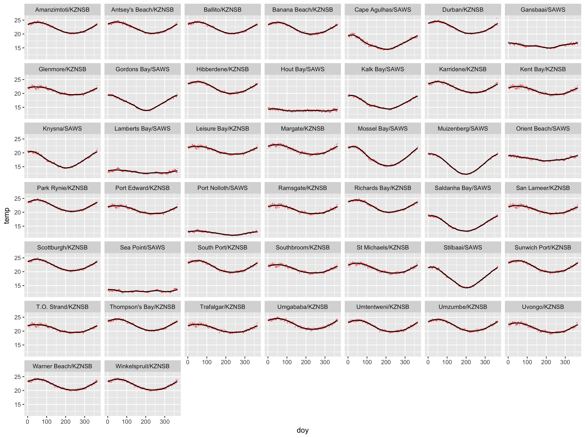
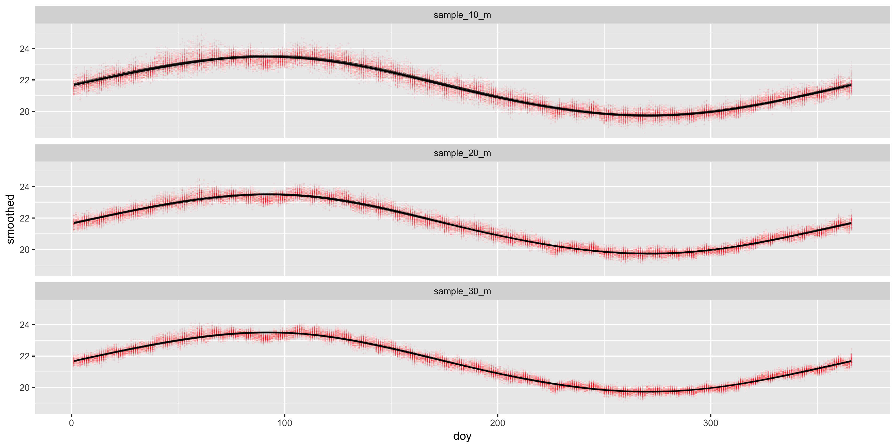

```{r global_options, include = FALSE}
knitr::opts_chunk$set(fig.width = 6, fig.align = 'center',
                      echo = FALSE, warning = FALSE, 
                      message = FALSE, tidy = FALSE,
                      eval = FALSE)
```

```{r setup, echo=FALSE}
library(plyr)
library(tidyverse) # misc. data processing conveniences
library(lubridate) # for working with dates
```

How does one create the best climatology? What if the time series is shorter than the recommended 30 years?

Lets look at all the SACTN data that's longer than 30 years first. Can each site's annual signal be represented by a sine/cosine curve as (i.e. the sum of sine and cosine curves derived from a Fourier analysis)?

```{r, echo=TRUE}
load("/Volumes/GoogleDrive/My Drive/SACTN/SACTNraw/data/4_products/SACTN_daily_v4.2.RData")
daily.in <- SACTN_daily_v4.2
rm(SACTN_daily_v4.2)
long_sites <- daily.in %>% 
  group_by(index) %>%
  summarise(n = n()) %>% 
  filter(n >= 365 * 30) %>% 
  ungroup()
```

Now, for each site that has >30 years of data, I create a daily climatology by taking the mean for each Julian day, using all data across the full duration of each time series.

```{r, echo=TRUE}
daily <- daily.in %>% 
  filter(index %in% long_sites$index) %>%
  mutate(index = as.character(index)) %>% 
  # droplevels() %>% 
  group_by(index) %>% 
  mutate(doy = yday(date)) %>% 
  group_by(index, doy) %>% 
  summarise(temp = mean(temp, na.rm = TRUE)) %>% 
  ungroup()
```


Now I make a function that will fit a Fourier series with seven basis functions (3 sine, 3 cosine and the constant) to the data. This is the same approach I used to create the smooth climatology in "Climatologies and baseline" elsewhere on this site. Here it is wrapped in a function so I can easily apply it to each time series.

```{r, echo=TRUE}
fFun <- function(data) {
  require(fda)
  b7 <- create.fourier.basis(rangeval = range(data$doy), nbasis = 7)

  # create smooth seasonal climatology
  b7.smth <- smooth.basis(argvals = data$doy, y = data$temp, fdParobj = b7)$fd
  data.smth <- eval.fd(data$doy, b7.smth)
  return(data.smth)
}
# currently this function fails when the 1st of January is an NA
```

```{r, echo=TRUE}
# which sites have NAs?
excl.sites <- c(daily[is.na(daily$temp), 1])$index

daily.nest <- daily %>% 
  filter(!index %in% excl.sites) %>% 
  nest(-index)

daily.smth <- daily.nest %>% 
  mutate(smoothed = map(data, fFun)) %>% 
  unnest(data, smoothed)
```

```{r, echo=TRUE}
plt1 <- daily.smth %>% 
  ggplot(aes(x = doy, y = temp)) +
  geom_point(shape = "+", colour = "red", alpha = 0.6, size = 1) +
  geom_line(aes(y = smoothed, group = index), size = 0.6, colour = "black") +
  facet_wrap(~index)
ggsave(plt1, file = "smooth_mat_1.png", width = 12, height = 9)
```

{width=100%}

## Time series length

There are instances when we might need to create climatologies when we don't have access to time series of 30 years or longer. To look at this problem, I created a quick bootstrap analysis to see what the effect of time series length is on the resultant climatology. In this instance I used a Fourier analysis (see Banzon et al., 2014) to calculate six modes within an annual cycle, and used these to reconstruct a smooth climatology. This technique is quite forgiving of SST seasonalities that depart from typical sinusoidal profiles, such as which we find along upwelling areas (I have tested this on our coastal seawater temperatures).

I used the Western Australian data that's packaged with the python and R marine heat wave scripts. Later I'll test this more widely on other time series. The WA time series is 32 years long. I treat all temperatures over the duration of the time series as a pool of data, separately for each day-of-year (doy); i.e. doy 1 has 32 temperatures, doy 2 also has 32 temperatures, etc. I assume that the temperature on doy 1 of 1982 is independent of that on doy 1 in every other year (etc.), so the sample of doy 1 temperatures is therefore independent and identically distributed (i.i.d.). I further assume that there's no autocorrelation from day-to-day (definitely erroneous, but I don't think it matters here).

For each day's pool of samples I then randomly take 10 samples and find the mean of that. This is the same as averaging over 10 years to obtain the mean for each of the 365 days (one year). Note that I did not apply the 11 day sliding window as per the heat wave function (windowHalfWidth), and rather opted to treat each doy independently as per Banzon et al. (2014). I repeat this 100 times, and so I effectively have estimates of a 100 annual cycles. I then do the same with 20 samples and 30 samples taken from the pool of available samples for each doy.

In total I now have 300 annual cycles: 100 of them representing a 10-year long times series, 100 representing a 20-year long time series, and 100 for a 30 year time series. To each of them, separately, I then fit the smooth climatology assembled from their Fourier components.

The attached plots show the outcome. The three panels represent 10, 20 and 30 year long time series. In Figure 2, each of the 100 daily time series is plotted as a line graph. In Figure 3, the red crosses show, for each doy, each of the 100 mean temperatures that I obtained. The black lines are of course the smooth climatologies--there is also 100 of these lines on each of the three panels. 

So, using bootstrapping and a Fourier analysis we can get away with using shorter time series. I can see later what happens if I shrink even further the time series down to only five years long. I will also test how well the python and R heatwave scripts' internal climatology functions (windowHalfWidth and smoothPercentile) are able to produce reliable climatologies from short time series.

```{r, echo=TRUE}
library(heatwaveR)
sst.in <- as_tibble(heatwaveR::sst_WA)
sst <- sst.in %>%
  mutate(doy = yday(as.Date(t))) %>%
  nest(-doy)

meanFun <- function(data) {
  m <- mean(data$temp, na.rm = TRUE)
  return(m)
}

sstRepl <- function(sst) {
  sst.sampled <- sst %>% 
    mutate(sample_10 = map(data, sample_n, 10, replace = TRUE),
           sample_20 = map(data, sample_n, 20, replace = TRUE),
           sample_30 = map(data, sample_n, 30, replace = TRUE)) %>% 
    mutate(sample_10_m = map(sample_10, meanFun),
           sample_20_m = map(sample_20, meanFun),
           sample_30_m = map(sample_30, meanFun)) %>% 
    select(-data, -sample_10, -sample_20, -sample_30) %>% 
    unnest(sample_10_m, sample_20_m, sample_30_m)
  return(sst.sampled)
}

library(purrr)
sst.repl <- purrr::rerun(100, sstRepl(sst)) %>% 
  map_df(as.data.frame, .id = "rep") %>% 
  gather(key = "ts.len", value = "temp", -rep, -doy)
```

```{r, echo=TRUE}
plt2 <- ggplot(data = sst.repl, aes(x = doy, y = temp)) +
  geom_line(aes(group = rep), alpha = 0.3, size = 0.1) +
  facet_wrap(~ts.len, nrow = 3)
ggsave(plt2, file = "rand_mat_raw_1.png", width = 12, height = 6)
```

{width=100%}

```{r, echo=TRUE}
sst.repl.nest <- sst.repl %>% 
  nest(-rep, -ts.len)

sst.repl.smth <- sst.repl.nest %>% 
  mutate(smoothed = map(data, fFun)) %>% 
  unnest(data, smoothed)
```

```{r, echo=TRUE}
plt3 <- ggplot(data = sst.repl.smth, aes(x = doy, y = smoothed)) +
  geom_point(aes(y = temp), shape = "+", colour = "red", alpha = 0.1, size = 1) +
  geom_line(aes(group = rep), alpha = 0.3, size = 0.1) +
  facet_wrap(~ts.len, nrow = 3)
ggsave(plt3, file = "rand_mat_smoothed_1.png", width = 12, height = 6)
```

{width=100%}
