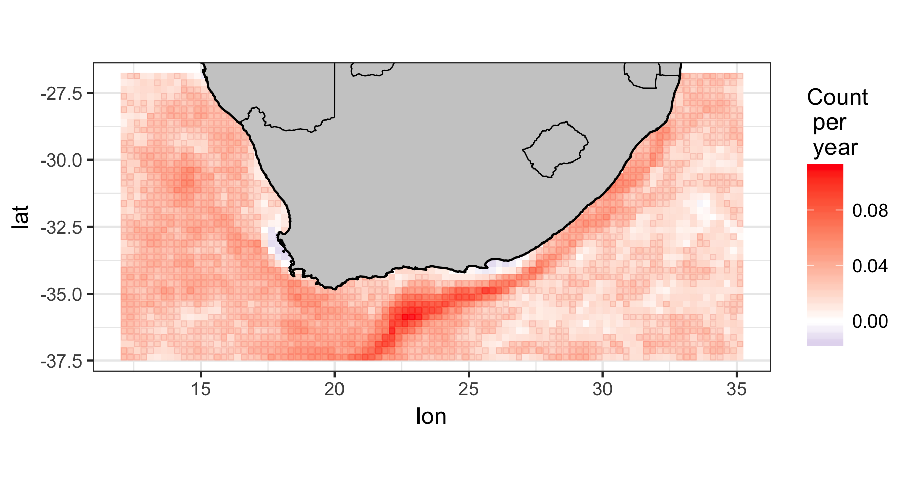

```{r global_options, include = FALSE}
knitr::opts_chunk$set(fig.width = 4, fig.align = 'center',
                      echo = FALSE, warning = FALSE, 
                      message = FALSE, tidy = FALSE)
```

```{r load-pkg, echo = FALSE, eval = FALSE}
library(RmarineHeatWaves)
library(ncdf4)
library(plyr)
library(dplyr)
library(tibble)
library(reshape2)
library(lubridate)
library(ggplot2)
library(doMC); doMC::registerDoMC(cores = 4)
```

## Overview

Because of human-induced climate change, we anticipate that extreme events would occur more frequently and that they would become greater in intensity. Here I address this question by using some gridded SST data, which is the only way that we can assess if this trend is unfolding across large ocean regions. Using the gridded [0.25 degree Reynolds OISST](http://dx.doi.org/10.1175/2007JCLI1824.1), I will find extreme SST events around South Africa data by applying the `detect()` function pixel-by-pixel. After detecting the events, I will fit a generalised linear model (GLM) to calculate rates of change in some marine heat wave metrics, and then plot the estimated trend. 

## Reading in the netCDF

First, I read in the 0.25 degree [OISST netCDF file](https://www.ncei.noaa.gov/thredds/blended-global/oisst-catalog.html). I save the only variable, **sst**, as a multidimensional array (longitude, latitude and date). To do this, I use the **ncdf4** package. I then construct a list with names and values for each dimension of the SST array. The example data used here cover 93 longitude and 43 latitude steps (i.e. 3999 pixels), and cover 12797 days (1981 to 2016). The names for the three dimensions are simply a list of longitudes, latitudes and dates, which I get directly from the netCDF file. Note that not all netCDF files are created equally, and sometimes vectors of longitudes, latitudes and dates need to be created based on the start values for lat/lon/date in the netCDF, and the 'steps' between sequential lats/lons/dates. To determine out how to approach reading in the netCDF file, use the `print()` function to scrutinise the content of the netCDF.

```{r read-netcdf, echo = TRUE, eval = FALSE}
nc <- nc_open("/Users/ajsmit/spatial/OISSTv2/daily/OISST-V2-AVHRR_agg.nc")
# print(nc)
sst <- ncvar_get(nc, varid = "sst") # reads in the only var in netCDF file
dimnames(sst) <- list(lon = nc$dim$lon$vals,
                      lat = nc$dim$lat$vals, 
                      t = nc$dim$time$vals)
```

Now I take this array of SST data and convert it into a a data frame using **reshape2**'s `melt()` function. This creates columns named **lon**, **lat** and **t** (the latter is the time vector, with the mandatory name **t**, which is required by **RmarineHeatWave**'s `make_whole()` and `detect()` functions). Now each SST value is indexed by a unique combination of **lon**, **lat** and **t**. Notice too how I use the **tibble** package's `as_tibble()` function together with `melt()`, because I like the way that it neatly creates a very readbale data frame.

```{r sst-df, echo = TRUE, eval = FALSE}
sst <- as_tibble(melt(sst, value.name = "temp"))
sst$t <- as.Date(sst$t, origin = '1978-01-01')
```

Since the data frame of SSTs contains some NAs where seawater temperatures are not available due to the presence of land, I remove all cases with NAs.

```{r remove-NA, echo = TRUE, eval = FALSE}
sst1 <- sst %>%
  na.omit()
rm(sst); rm(nc)
```

## Event detection

Now I make a wrapper function to combine `make_whole()` and `detect()`. This increases the ease of use of this function with **plyr**'s `ddply()` function, but most importantly, it pulls out only the **event** portion of the list of results (i.e. ignoring **clim**).

```{r detect-fun, echo = TRUE, eval = FALSE}
OISST_detect <- function(dat) {
  dat <- dat[,3:4]
  start = "1983-01-01"
  end = "2012-12-31"
  whole <- make_whole(dat)
  mhw <- detect(whole, climatology_start = start, climatology_end = end,
                min_duration = 5, max_gap = 2, cold_spells = FALSE)
  events <- mhw$event
  return(events)
  }
```

And now I apply the `OISST_detect()` function to the SST data and save the results as an intermediate .Rdata file.

```{r apply-detect-fun, echo = TRUE, eval = FALSE}
# it takes a long time...
system.time(OISST_events <- ddply(sst1, .(lon, lat), OISST_detect, .parallel = TRUE))
 #   user  system elapsed 
 # 1862.3   205.9   704.8 
save(OISST_events, file = "/Users/ajsmit/spatial/OISSTv2/MHWs/OISST_events.Rdata")
```

Because I saved the results to a file I can load these rather than rerunning the `OISST_detect()` function, which takes about 11 minutes to execute on my 4 GHz iMac.

```{r load-SST, echo = TRUE, eval = FALSE}
# in case it was calculated and saved earlier, we can load it here now:
load("/Users/ajsmit/spatial/OISSTv2/MHWs/OISST_events.Rdata")
```

## Trend detection

```{r event-tally, echo = TRUE, eval = FALSE}
# summarise the number of unique longitude, latitude and year combination:
event_freq <- OISST_events %>% 
  mutate(year = year(date_start)) %>% 
  group_by(lon, lat, year) %>% 
  summarise(n = n())
head(event_freq)

# create complete grid for merging with:
sst.grid <- sst1 %>% 
  select(lon, lat, t) %>% 
  mutate(t = lubridate::year(t)) %>% 
  unique() # slow...
colnames(sst.grid)[colnames(sst.grid) == 't'] <- 'year'

# and merge:
OISST_n <- left_join(sst.grid, event_freq)
OISST_n[is.na(OISST_n)] <- 0
```

```{r trend-fun, echo = TRUE, eval = FALSE}
lin_fun <- function(ev) {
  mod1 <- glm(n ~ year, family = poisson(link = "log"), data = ev)
  # mod1 <- lm(n ~ year, data = ev)
  tr <- summary(mod1)$coefficients[2,c(1,4)] # extract slope coefficient and its p-value
  return(tr)
}
```

```{r apply-trend-fun, echo = TRUE, eval = FALSE}
OISST_nTrend <- ddply(OISST_n, .(lon, lat), lin_fun)
OISST_nTrend$pval <- cut(OISST_nTrend[,4], breaks = c(0, 0.001, 0.01, 0.05, 1))
head(OISST_nTrend)
```

```{r load-geography, echo = TRUE, eval = FALSE}
## Coastline of African continent and some borders:
load("/Users/ajsmit/Dropbox/repos/Trend_Analysis/graph/africa_coast.RData")
load("/Users/ajsmit/Dropbox/repos/Trend_Analysis/graph/africa_borders.Rdata")
load("/Users/ajsmit/Dropbox/repos/Trend_Analysis/graph/south_africa_coast.RData")
load("/Users/ajsmit/Dropbox/repos/Trend_Analysis/graph/sa_provinces_new.RData")
```

```{r the-figure, echo = TRUE, eval = FALSE}
ggplot(OISST_nTrend, aes(x = lon, y = lat)) +
  geom_rect(size = 0.2, fill = NA,
       aes(xmin = lon - 0.1, xmax = lon + 0.1, ymin = lat - 0.1, ymax = lat + 0.1,
           colour = OISST_nTrend[,5])) +
  geom_raster(aes(fill = Estimate), interpolate = FALSE, alpha = 0.9) +
  scale_fill_gradient2(name = "Count\n per\n year", high = "red", mid = "white",
                       low = "darkblue", midpoint = 0) +
  scale_colour_manual(breaks = c("(0,0.001]", "(0.001,0.01]", "(0.01,0.05]", "(0.05,1]"),
                      values = c("firebrick1", "firebrick2", "firebrick3", "white"),
                      name = "p-value", guide = FALSE) +
  geom_polygon(data = south_africa_coast, aes(x = lon, y = lat, group = group), 
               colour = NA, fill = "grey80") +
  geom_path(data = africa_borders, aes(x = lon, y = lat, group = group), 
            size = 0.3, colour = "black") +
  geom_polygon(data = south_africa_coast, aes(x = lon, y = lat, group = group),
               size = 0.5, colour = "black", fill = NA) +
  coord_fixed(ratio = 1, xlim = c(12.12, 35.12), ylim = c(-26.88, -37.38), expand = TRUE) +
  theme_bw()
ggsave(file = "README-grid-example1.png", width = 6, height = 3.2)

ggplot(OISST_nTrend, aes(lon, lat)) +
  geom_raster(aes(fill = pval), interpolate = FALSE) +
  scale_fill_manual(breaks = c("(0,0.001]", "(0.001,0.01]", "(0.01,0.05]",
                               "(0.05,0.1]", "(0.1,0.5]", "(0.5,1]"),
                    values = c("black", "grey20", "grey40",
                               "grey80", "grey90", "white"),
                    name = "p-value") +
  geom_polygon(data = south_africa_coast, aes(x = lon, y = lat, group = group), 
               colour = NA, fill = "grey80") +
  geom_path(data = africa_borders, aes(x = lon, y = lat, group = group), 
            size = 0.3, colour = "black") +
  geom_polygon(data = south_africa_coast, aes(x = lon, y = lat, group = group), 
               size = 0.5, colour = "black", fill = NA) +
  coord_fixed(ratio = 1, xlim = c(12.12, 35.12), ylim = c(-26.88, -37.38), expand = TRUE) +
  theme_bw()
ggsave(file = "README-grid-example2.png", width = 6, height = 3.2)
```

<!-- ```{r, echo = FALSE, include = TRUE, out.width = "580px", fig.cap = "**Figure 1.** Plot of marine heat waves detected in the 0.25 degree Reynold's OISST around South Africa, showing the increase in frequency of marine heat waves within the Agulhas Current. Outlined pixels indicate that the trend is significant at p < 0.05."} -->
<!--  -->
<!-- ``` -->

<!-- ```{r, echo = FALSE, include = TRUE, out.width = "580px", fig.cap = "**Figure 2.** Plot of marine heat waves found in the 0.25 degree Reynold's OISST around South Africa, showing the significance of the detected trend in frequency of marine heat waves within the Agulhas Current."} -->
<!-- knitr::include_graphics("README-grid-example2.png") -->
<!-- ``` -->

{width=100%}

{width=100%}

